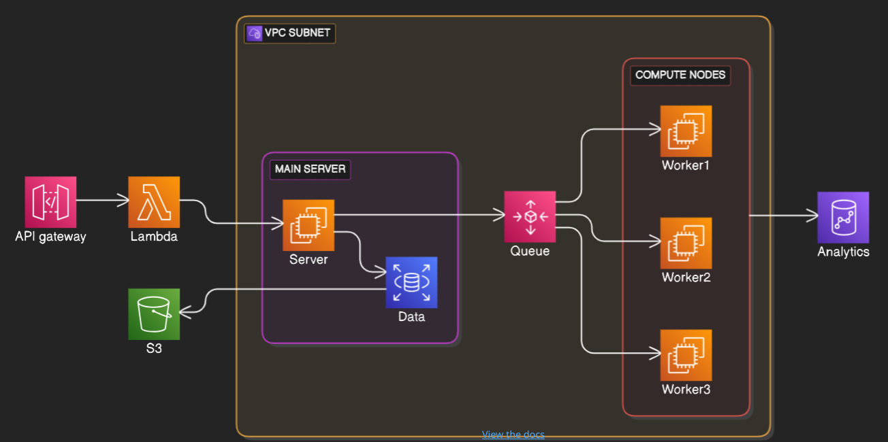

# TERRAFORM TEMPLATE

## Description

This project focuses on designing and deploying a cloud infrastructure ....

The accompanying diagram illustrates the overall architecture and replaces a lengthy textual explanation.

### Infra Diagram



## Getting Started

### Prerequisites

List all dependencies and their version needed by the project as :

* [Debian 13](https://www.debian.org/download)
* [VSCode 1.109.3](https://code.visualstudio.com/download)
* [Terraform v1.14.5](https://developer.hashicorp.com/terraform/install)

### Cloud Provider Configuration (only AWS for now)

* AWS Cloud Provider Accesses (IAM)
  * [IAM Policy sample for EC2](./appendices/aws-iam-ec2-policy.json)
  * Optional : only if you need to share your terraform state
     * [IAM Policy sample for S3](./appendices/aws-config/iam/aws-iam-bucket-policy.json)
     * [IAM Policy sample for DynamoDB](./appendices/aws-config/iam/aws-iam-dynamodb-policy.json)

* AWS CLI
  * [Install](https://docs.aws.amazon.com/cli/latest/userguide/getting-started-install.html) 
  * Profile Setup (to avoid hard coded credentials in terraform deployment script)
  * You need credentials delivered by your Cloud Administrator
  * Optional : only if you need to share your terraform state
     * S3
        * [Create S3 Bucket](./appendices/aws-config/cli/bucket-create.sh)
        * [Enable Bucket Versioning](./appendices/aws-config/cli/bucket-enable-versioning.sh)
     * DynamoDB
        * [Create DynamoDb Table](./appendices/aws-config/cli/dynamo-db-create-table.sh)
```
  aws configure --profile <stage>
```

Don’t forget to align the Terraform provider configuration.

```
//Set the profile to plan and apply the deployment
//environment/<stage>/provider.tf
  provider "aws" {
    profile = "dev"
    region  = "us-west-2"
  }
```

```
//Set the backend to save and share the terraform state
//environment/<stage>/backend.tf
  terraform {
    backend "s3" {
      bucket = "you-bucket-name"
      key    = "environments/<stage>/terraform.tfstate"
      region = "you-cloud-region"
      profile = "your-cli-profile"
    }
  } 
``` 


## Deployment step

* Init

```
  terraform -chdir=environments/<stage> init
```

* Plan

```
  terraform -chdir=environments/<stage> plan
```

* Apply

```
terraform -chdir=environments/<stage> apply
```

## Project structure

```shell
terraform-project/
│
├── modules/
│   ├── vpc/
│   │   ├── main.tf
│   │   ├── variables.tf
│   │   ├── outputs.tf
│   │
│   └── ec2/
├── environments/
│   ├── dev/
│   │   ├── main.tf
│   │   ├── provider.tf
│   │   ├── variables.tf
│   │   ├── terraform.tfvars
│   │   └── backend.tf
│   │
│   ├── staging/
│   └── prod/
│
├── global/
│   ├── backend.tf
│   └── provider.tf
│
├── versions.tf
├── README.md
└── .gitignore
```

## Collaborate

* Take time to read some readme and find the way you would like to help other developers collaborate with you.

* How to propose a new feature -> [Write an issue first](https://github.com/CPNV-Common/TERRAFORM-PROJECT-TEMPLATE/issues/new)
* How to commit -> [We use coventional commits approach](https://www.conventionalcommits.org/en/v1.0.0/)
* How to use your workflow -> [Our branches strategy is based on Gitflow](https://nvie.com/posts/a-successful-git-branching-model/)

## License

[Apache Licence](./LICENCE.md)

## Contact

* Open an [issue](https://github.com/CPNV-Common/TERRAFORM-PROJECT-TEMPLATE/issues/new) direclty on this repo
